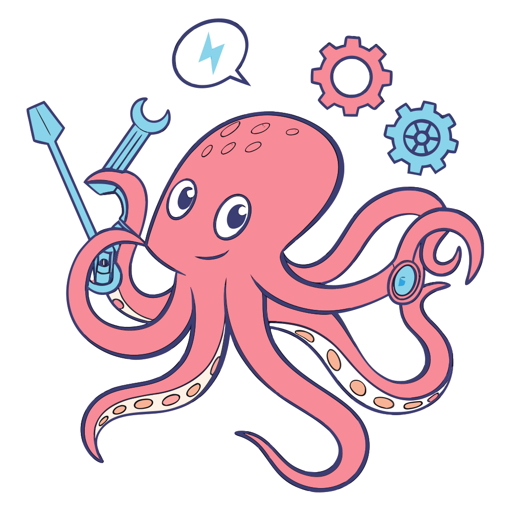

<p align="center"></p>

<pre align="center">
██████╗  ██████╗ ██╗     ██████╗  ██████╗
██╔══██╗██╔═══██╗██║     ██╔══██╗██╔═══██╗
██████╔╝██║   ██║██║     ██████╔╝██║   ██║
██╔═══╝ ██║   ██║██║     ██╔═══╝ ██║   ██║
██║     ╚██████╔╝███████╗██║     ╚██████╔╝
╚═╝      ╚═════╝ ╚══════╝╚═╝      ╚═════╝
</pre>

<p align="center">
  <strong>AI agent orchestration framework — build virtual AI companies.</strong>
</p>

<p align="center">
  <a href="#quick-start">Quick Start</a> &bull;
  <a href="#features">Features</a> &bull;
  <a href="#architecture">Architecture</a> &bull;
  <a href="#project-structure">Project Structure</a> &bull;
  <a href="https://openpolpo.dev">Docs</a>
</p>

<p align="center">
  
  
  
  
</p>

---

OpenPolpo coordinates teams of AI agents working together on complex software tasks. Define plans in JSON, assign tasks to specialized agents, and let Polpo handle orchestration, assessment, approval gates, notifications, and recovery.

When no adapter is specified, Polpo uses its **built-in engine** (Pi Agent) — a full agentic loop with 7 coding tools, 18+ LLM providers, and MCP support. The `claude-sdk` adapter integrates with the Claude Agent SDK.

## Quick Start

### 1. Install

```bash
npm install -g openpolpo
```

### 2. Initialize

```bash
polpo init
```

Creates a `.polpo/` directory with a `polpo.json` config file.

### 3. Configure agents and a plan

```json
{
  "agents": [
    {
      "name": "backend-dev",
      "adapter": "claude-sdk",
      "description": "Backend developer specializing in Node.js and databases"
    },
    {
      "name": "frontend-dev",
      "description": "Frontend developer specializing in React and TypeScript"
    }
  ],
  "plans": [
    {
      "group": "build-mvp",
      "tasks": [
        {
          "title": "Create database schema",
          "assignTo": "backend-dev",
          "description": "Design and implement SQLite schema for users and posts"
        },
        {
          "title": "Build React components",
          "assignTo": "frontend-dev",
          "description": "Create reusable UI components with shadcn/ui",
          "dependsOn": ["Create database schema"]
        }
      ]
    }
  ]
}
```

When `adapter` is omitted, the built-in engine (Pi Agent) is used automatically.

### 4. Run

```bash
polpo              # Interactive terminal UI
polpo run          # Headless execution
polpo serve        # HTTP API server (default: 127.0.0.1:3000)
```

## Features

### Core

- **Multi-agent orchestration** — coordinate any number of agents with plan-based task execution, dependency resolution, and inter-agent communication
- **7 task states** — `pending` → `awaiting_approval` → `assigned` → `in_progress` → `review` → `done` / `failed`, with validated transitions
- **8-phase assessment pipeline** — G-Eval LLM-as-judge scoring across configurable dimensions (correctness, completeness, code quality, edge cases)
- **Crash-resilient runners** — detached agent subprocesses tracked in a persistent RunStore; automatic reconnection on restart
- **Deadlock detection** — identifies circular dependencies and uses LLM-assisted resolution

### Quality & Operations

- **15 lifecycle hooks** — `before`/`after` hooks on task, plan, assessment, quality, scheduling, and orchestrator events; before-hooks can cancel or modify operations
- **Approval gates** — hybrid auto/human gates; automatic condition evaluation or blocking for human review with configurable timeouts
- **Notification system** — Slack, Telegram, Email, and Webhook channels with template-based routing
- **4-level escalation chain** — automatic escalation from retry → reassign → notify → human intervention
- **Quality gates** — plan-level quality checkpoints that block progression until score thresholds are met
- **SLA deadline monitoring** — warning and violation events for task and plan deadlines
- **Cron-based plan scheduling** — recurring plan execution via cron expressions

### Interfaces

- **REST API** — Hono-based HTTP server with Zod-validated endpoints
- **SSE + WebSocket** — real-time event streaming with glob-based filtering (`task:*`, `agent:*`)
- **Terminal UI** — Ink-based TUI with Dashboard, Tasks, Plans, Agents, Logs, and Chat tabs
- **Web UI** — Vite + React monitoring dashboard with shadcn/ui (see `ui/`)
- **React SDK** — type-safe hooks with SSE-backed push updates (see `packages/react-sdk/`)

### Developer Experience

- **Multiple adapters** — built-in engine (Pi Agent), Claude SDK, and generic CLI adapter
- **Multiple store backends** — File (default), JSON, and SQLite for tasks, runs, sessions, and logs
- **MCP support** — connect external tool servers to any agent with automatic tool bridging
- **Filesystem sandbox** — restrict agent file access via `allowedPaths`
- **Skills system** — reusable agent instructions in `.polpo/skills/`, auto-injected into system prompts
- **55+ typed events** — organized across 19 categories, consumed by TUI, SSE, WebSocket, and notifications
- **Security** — `safeEnv` strips secrets from subprocesses, no-eval condition DSL, localhost-only default binding

## Architecture

```
                       polpo.json
                           |
                           v
                   ┌───────────────┐
                   │  Orchestrator  │
                   │   (5s tick)    │
                   └───────┬───────┘
                           |
             ┌─────────────┼─────────────┐
             v             v             v
       ┌──────────┐ ┌──────────┐ ┌──────────┐
       │  Runner   │ │  Runner   │ │  Runner   │
       │ (detached)│ │ (detached)│ │ (detached)│
       └─────┬────┘ └─────┬────┘ └─────┬────┘
             v             v             v
       Built-in       Claude SDK    Built-in
        Engine          Adapter      Engine
```

The orchestrator runs a supervisor loop every 5 seconds (`POLL_INTERVAL = 5000`), assigning pending tasks to agents, monitoring health, and driving the assessment pipeline.

### Task State Machine

```
                      ┌───────────────────┐
                      v                   |
pending ──> awaiting_approval ──> assigned ──> in_progress ──> review ──> done
                |                                               |
                v                                               v
              failed <──────────────────────────────────────  failed
                |
                v
             pending (retry)
```

Seven states with validated transitions. Tasks flow forward through assignment, execution, and review. Failed tasks can be retried back to `pending`. Approval gates optionally intercept the `pending → assigned` transition.

## Project Structure

```
openpolpo/
├── src/
│   ├── core/               # Orchestrator, config, types, events, hooks, state machine
│   │                       #   approval manager, escalation, task/plan managers
│   ├── adapters/           # Built-in engine (Pi Agent) + Claude SDK adapter
│   ├── assessment/         # G-Eval assessor, scoring dimensions, fix phase
│   ├── quality/            # Quality controller, SLA monitor
│   ├── scheduling/         # Cron parser, plan scheduler
│   ├── notifications/      # Notification router + channels (Slack, Telegram, Email, Webhook)
│   ├── tools/              # 7 coding tools, path sandbox, safeEnv
│   ├── mcp/                # MCP client manager and tool bridging
│   ├── stores/             # File, JSON, SQLite stores (tasks, runs, sessions, logs, config)
│   ├── llm/                # LLM queries, prompts, plan generation, skills
│   ├── tui/                # Terminal UI (Ink) + TUI commands
│   ├── server/             # Hono HTTP API, SSE bridge, WebSocket bridge, routes
│   ├── bridge/             # Passive session discovery for external agents
│   ├── cli/                # Commander CLI entry point + subcommands
│   └── index.ts            # Barrel exports
├── ui/                     # Vite + React monitoring dashboard
├── apps/
│   └── docs/               # Astro + Starlight documentation site
├── packages/
│   └── react-sdk/          # React hooks + SSE client (@openpolpo/react-sdk)
└── polpo.json              # Your project configuration
```

## Documentation

Full documentation is available at [openpolpo.dev](https://openpolpo.dev), including:

- Configuration reference (`polpo.json` schema)
- API endpoint documentation
- Adapter guides (built-in engine, Claude SDK)
- Assessment and quality pipeline details
- Notification and escalation setup
- Hook and event reference

## Contributing

We welcome contributions! See [CONTRIBUTING.md](CONTRIBUTING.md) for setup instructions, coding standards, and PR guidelines.

```bash
git clone https://github.com/openpolpo/openpolpo.git
cd openpolpo
pnpm install
pnpm run build
pnpm run test -- --run
```

## Security

If you discover a security vulnerability, please report it responsibly. See [SECURITY.md](SECURITY.md) for details.

## License

[MIT](LICENSE)

---

<p align="center">
  <sub>Built with tentacles.</sub>
</p>
