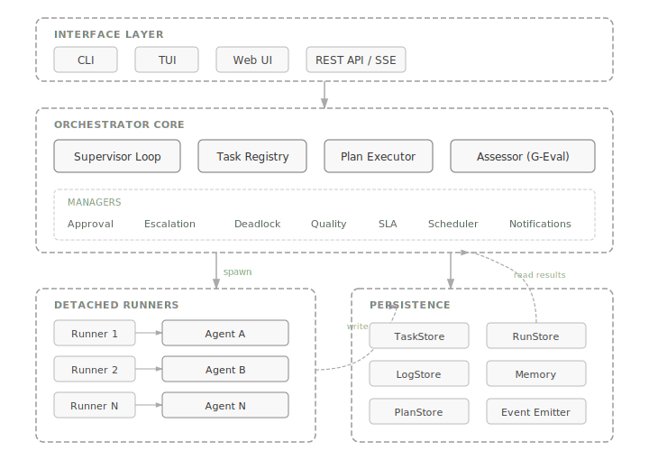
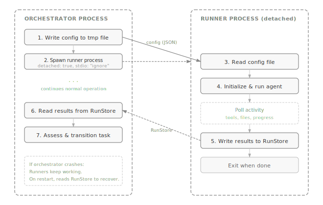

import { Aside } from '@astrojs/starlight/components';

## Overview

Polpo follows a **supervisor architecture**: a central orchestrator manages agent lifecycles, task assignment, assessment, and error recovery. Agents are isolated processes that know nothing about each other — Polpo handles all coordination.

The system is composed of four layers:

1. **Interface layer** — CLI, TUI, Web UI, and REST API provide different ways to interact with the orchestrator
2. **Orchestrator core** — the supervisor loop, task registry, plan executor, and all the managers (assessment, approvals, escalation, scheduling, etc.)
3. **Runner layer** — detached subprocesses that host individual agents, communicating with the orchestrator via the file-based RunStore
4. **Agent layer** — the actual AI agents (Claude, GPT, Codex, etc.) powered by the built-in engine



## Built-in Engine

Polpo uses a built-in multi-provider LLM engine to run all agents. The engine supports 18+ providers (OpenAI, Anthropic, Google, Groq, Mistral, Ollama, etc.) and manages agent lifecycles through an `AgentHandle`:

```typescript
interface AgentHandle {
  agentName: string;
  taskId: string;
  pid: number;              // real process ID
  sessionId?: string;       // optional session ID for transcript access
  activity: AgentActivity;  // live activity data (tools, files, progress)
  done: Promise<TaskResult>; // resolves when agent finishes
  isAlive(): boolean;
  kill(): void;
}
```

## Supervisor Loop

The orchestrator runs a **5-second tick loop** that:

1. **Collects results** from terminated runners (via RunStore)
2. **Assesses** completed tasks using the configured expectations
3. **Retries** failed tasks (with fix phase for targeted corrections)
4. **Spawns** new agents for pending tasks whose dependencies are met
5. **Enforces health checks** — kills stale or timed-out agents
6. **Detects deadlocks** — tasks blocked on failed dependencies ([Deadlock Resolution](/features/deadlock-resolution/))
7. **Recovers orphans** — reconnects to live processes after a crash
8. **Checks SLA deadlines** — emits warnings or violations when deadlines approach
9. **Evaluates quality gates** — blocks plan progression until thresholds are met
10. **Processes approval gates** — transitions tasks through `awaiting_approval` when required

## Detached Runners

Each agent runs as a **detached subprocess** (`runner.ts`), completely independent of the orchestrator process:



This architecture means:
- **Crash resilience**: If the orchestrator crashes, runners keep working
- **Process isolation**: One agent crashing doesn't affect others
- **Orphan recovery**: On restart, the orchestrator reconnects to live runners

## Event System

Polpo uses a **typed event emitter** with 55+ event types organized by category:

| Category | Events | Description |
|----------|--------|-------------|
| `task:*` | created, transition, updated, removed, retry, fix, maxRetries, timeout, recovered, question, answered | Task lifecycle |
| `agent:*` | spawned, finished, activity, stale | Agent lifecycle |
| `assessment:*` | started, progress, complete, corrected | Task assessment |
| `orchestrator:*` | started, tick, deadlock, shutdown | System events |
| `deadlock:*` | detected, resolving, resolved, unresolvable | Deadlock resolution |
| `plan:*` | saved, executed, completed, resumed, deleted | Plan lifecycle |
| `session:*` | created, message:added | Chat sessions |
| `bridge:*` | session:discovered, session:activity, session:completed | External sessions |
| `approval:*` | requested, resolved, timeout | Approval gates |
| `sla:*` | warning, violated, met | SLA monitoring |
| `quality:*` | gate:passed, gate:failed, threshold:failed | Quality gates |
| `schedule:*` | triggered, created, completed | Plan scheduling |
| `escalation:*` | triggered, resolved, human | Escalation chain |
| `notification:*` | sent, failed | Notification delivery |
| `log` | — | General log messages |

Events are consumed by the TUI, HTTP/SSE server, and WebSocket bridge. See [Events Reference](/reference/events/) for full payload details.

## Persistence

| Component | Storage | Purpose |
|-----------|---------|---------|
| Task Registry | File-based store (default) | Task state with atomic writes |
| RunStore | File-based store (default) | Runner process tracking |
| Log Store | File-based store (default) | Persistent event log |
| Plan Store | File-based store (default) | Plan definitions and status |
| Memory | File (`.polpo/memory.md`) | Project context for agents |
| Runner configs | JSON (`.polpo/tmp/`) | Temporary config for detached runners |

File-based stores are the default. SQLite and JSON are available as alternatives via configuration.

<Aside>
File-based stores use atomic write operations to handle concurrent access from the orchestrator and multiple runner processes.
</Aside>
